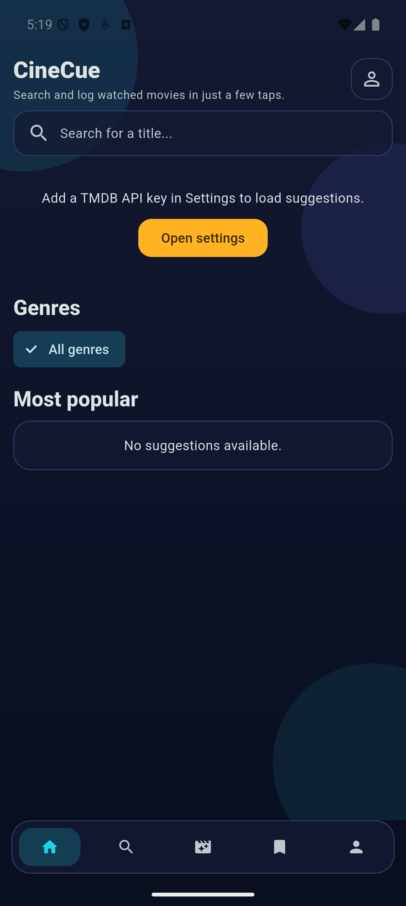
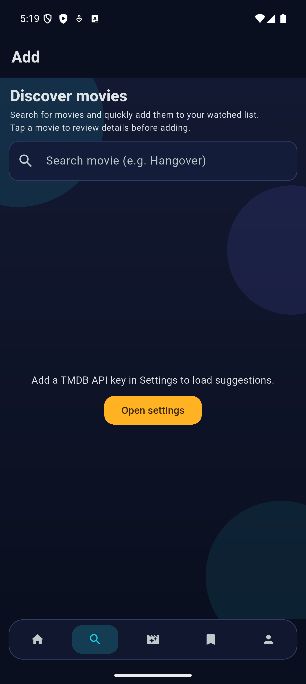
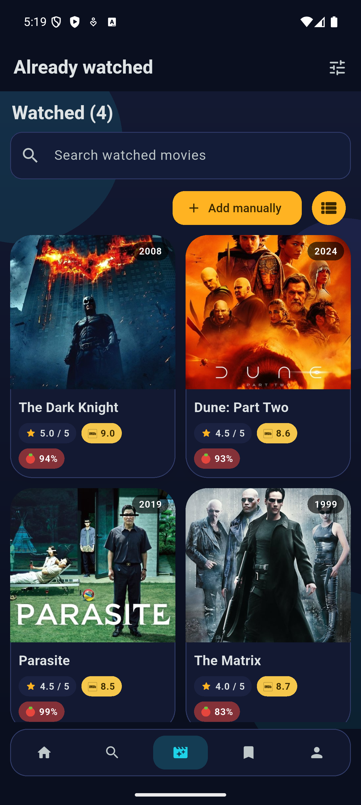
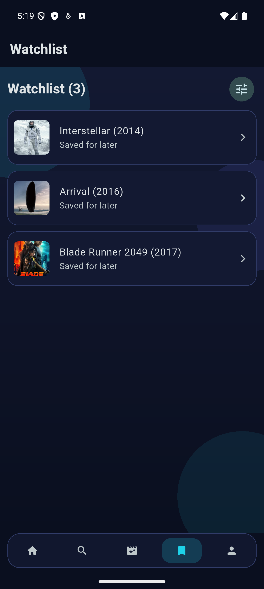
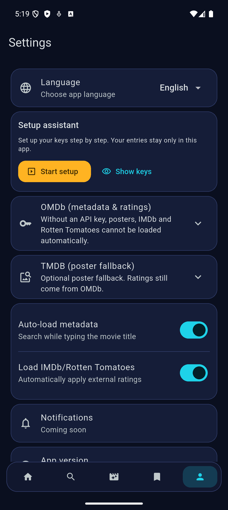

# CineCue

CineCue is a Flutter movie tracker focused on fast logging, clean visuals, and on-device privacy.
You can discover titles, rate them with half-star precision, keep a watchlist, and store everything locally on the user device.

## Highlights

- Modern dark UI with bottom-tab navigation: Home, Add, Watched, Watchlist, Settings
- Fast title search and detail preview before adding a movie
- Watched library with poster grid, sorting, and edit/delete flows
- Watchlist with dedicated sorting options
- Rating flow with live-updating half-star input
- External ratings support (IMDb + Rotten Tomatoes via OMDb)
- Poster fallback support via TMDB
- Guided setup wizard for API keys inside the app
- English and German localization
- Fully local persistence (SQLite + SharedPreferences)

## Screenshots

<p align="center">
  
  
  
</p>

<p align="center">
  
  
  
</p>

## Project Structure

```text
lib/
  app/
    localization/
    pages/
    settings/
  core/
    data/
  features/
    movies/
      models/
      pages/
      services/
      widgets/
    onboarding/
    settings/
```

## Local Development

### Requirements

- Flutter SDK (stable)
- Android Studio / Xcode toolchains
- A running simulator/emulator or physical device

### Run the app

```bash
flutter pub get
flutter run
```

### Quality checks

```bash
flutter analyze
flutter test
```

## Metadata Setup (Optional)

You can run CineCue without API keys.
If you want automatic metadata, posters, IMDb rating, and Rotten Tomatoes score:

1. Open **Settings** in the app.
2. Start the **Setup assistant**.
3. Add your keys:
   - **OMDb API key** for metadata + IMDb/Rotten Tomatoes ratings
   - **TMDB API key** for discover feed + poster fallback

The app stores keys locally on the device. No custom backend is required.

## CI / Release

This repository includes GitHub Actions workflows:

- Secret scanning workflow (`.github/workflows/secret-scan.yml`)
- Release workflow (`.github/workflows/release.yml`)
  - Builds Android release APK
  - Publishes the APK to a GitHub Release (tag-based)
  - Runs an iOS build (`--no-codesign`) and uploads the build output as an artifact
  - Uses branded APK names (`CineCue-<tag>.apk` on releases)

### Create a release build

- Push a semantic version tag, for example:

```bash
git tag v1.0.0
git push origin v1.0.0
```

The workflow will create a GitHub Release and attach the APK automatically.

## Notes on iOS

The CI iOS job is compile-oriented (`--no-codesign`).
To publish an installable IPA, signing certificates and provisioning profiles are still required.
